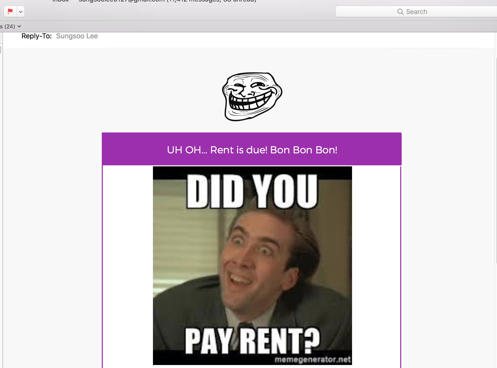

# email-marketing

At my current company, I have used [Sparkpost](https://app.sparkpost.com/) and [Sendgrid](https://sendgrid.com/) for our email marketing.
It's a great opportunity to learn about how to draft a email with responsive UI and minimize risks for our marketing emails from
not going to spam.

Few tips:
* Make sure you use ``` <table></table>``` for your UI. ```<div>``` tag breaks in some email clients like Gmail or Outlook.
* Before you start the email campaign, test it with mailtester(https://www.mail-tester.com) to see the reputation of your IP.
* Inline styling always.




This email was 7/10 on Mailtester which is good. I used my uci email since gmail.com is blacklisted. Still, uci.edu domain doesn't that good reputation.
If you purchased your new domain, it should be better than 7/10.
I applied this knowledge to create my own email campaign for my friends to pay their rent on time :)

I hope this can help you from email campaign too!


